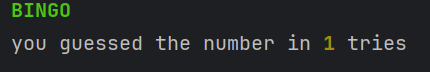

# Lecture 7- sep-18

## learned subjects:

1) continue keyword in loops:
    * same as break, but only to exit the current iteration and continue stay in the loop.
2) basic algorithm of the maximum and minimum numbers.
3) None-type: 
    * The None keyword is used to define a **null** value, or no value at all.
    * None is **not**  the same as 0, False, or an empty string. None is a data type of its own (NoneType) and only None
      can be None.
    * shortcut conditions:
        ```
      max_n=None;
      ...
      if max_n is None or num>max_n:
             max_n=num
        ```
    * instead max_num==0 you can write: max_n is None

### Extra:

* colors in console- build-in:
    * colors of tables references:
        * https://stackoverflow.com/questions/287871/how-do-i-print-colored-text-to-the-terminal/21786287#21786287
        * https://gist.github.com/RabaDabaDoba/145049536f815903c79944599c6f952a
    * in the print() , you can style the output with text color, bold/bold intensity,underline ,background colors

    * examples:
   ```
   print("\033[1;92mBINGO\033[0m")  ## in BOLD with intensity in color green
   print(f"you guessed the number in \033[1;33m{tries}\033[0m tries") ## on the value of {tries} in yellow color
   ```
  